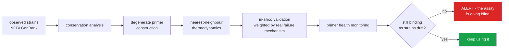
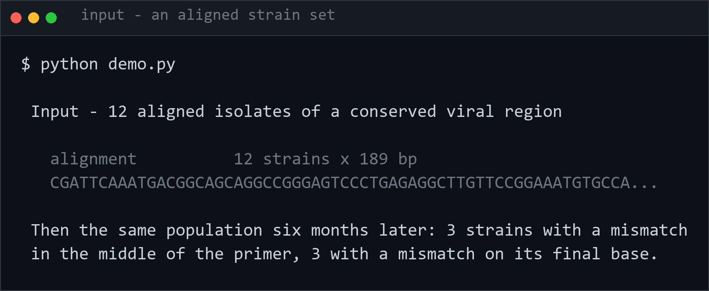
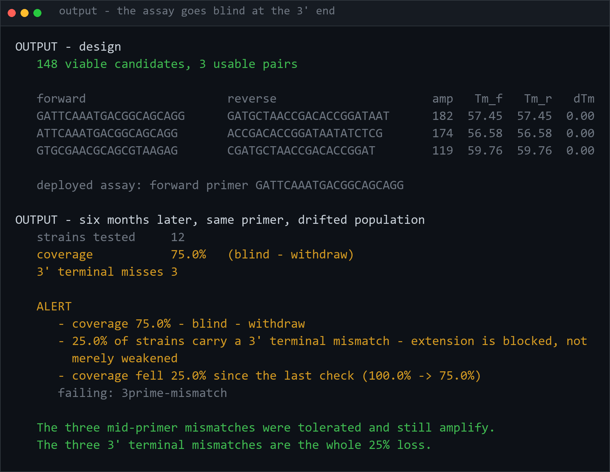

<h1 align="center">primer-designer (Python · nearest-neighbour thermodynamics · conservation analysis)</h1>
<p align="center"><i>Diagnostic PCR primers that survive a virus mutating - and an alert when they stop</i></p>

<p align="center">
  <a href="#why-a-diagnostic-test-goes-blind">Why a test goes blind</a> &middot;
  <a href="#on-real-strains-the-answer-is-no">On real strains</a> &middot;
  <a href="#primer-health-monitoring">Health monitoring</a> &middot;
  <a href="#a-real-bug-this-project-caught">A real bug caught</a> &middot;
  <a href="#thermodynamics">Thermodynamics</a> &middot;
  <a href="#conservation-and-degeneracy">Conservation</a> &middot;
  <a href="#problems-hit-while-building-this">Problems hit</a>
</p>

<p align="center">
  <a href="https://github.com/hammasbuilds/primer-designer/actions/workflows/ci.yml"></a>
  
  
  
  <a href="LICENSE"></a>
</p>

---

## Why a diagnostic test goes blind



**A diagnostic test does not fail loudly.** It keeps returning negatives while the virus it
was designed against drifts out from under it - so the monitoring, not the design, is the
part that matters.


A PCR primer is a short sequence that must match the pathogen it is looking for.
Viruses mutate. When a mutation lands under a primer binding site, the primer stops
binding and the test returns **negative** — not "inconclusive", not an error. The assay
goes blind while continuing to report confidently, and the controls all pass.

**Cotton Leaf Curl Virus is a live case.** Resistance-breaking strains circulating in
Punjab have defeated both resistant cotton cultivars and the PCR primers used to detect
them. A grower's field tests clean while the crop fails.

### The asymmetry the whole tool turns on

**A mismatch at the 3′ end is not like a mismatch anywhere else.**

Taq polymerase extends from the 3′ terminus. A mismatch in the middle of a primer
lowers the melting temperature slightly and the reaction usually still works. A
mismatch at the *terminal* base blocks extension almost completely — the primer still
binds, so nothing looks wrong, and nothing amplifies.

So mismatches are **weighted by distance from the 3′ end**, not counted:

```python
score_against(primer, drifted_internal).penalty   #  0.3  — fine
score_against(primer, drifted_terminal).penalty   # 10.0  — dead
```

One nucleotide of drift in the wrong place is the difference between a working
diagnostic and a national blind spot. That curve *is* the biology; flattening it would
produce a tool that cheerfully approves primers which cannot extend.

## On real strains, the answer is no

`demo.py` builds its alignment from a fixed random seed. That is right for showing the
*mechanism* - reproducible, no network, and the failure is obvious. It is useless as
evidence, because a synthetic alignment has exactly the conservation its generator gave it.

So: **210 Cotton leaf curl Multan virus haplotypes from NCBI GenBank**, aligned, committed
to `data/`. One sequence per haplotype rather than one per record - 250 records collapse to
210, and a single 2021 Punjab submission contributes eight identical genomes that would
otherwise vote eight times on how safe a site is.

```
CONSERVATION
    1419 of 3162 columns are invariant across all 210
    2517 are >= 98% conserved
     437 are gapped in more than 10% of strains

DESIGN at min_conservation=0.99      2 candidates,   0 usable pairs
DESIGN at min_conservation=0.98     22 candidates,   0 usable pairs
DESIGN at min_conservation=0.95     48 candidates,   3 usable pairs
     GTTCAGATATTTGAGGACTTGGGT  TCGGAAAGCTCTGGGACT  amp=120  pair coverage 98.1%
```

**You cannot build a diagnostic pair for this virus at 98% conservation.** Not "it is hard" -
there are 22 viable single primers and no two of them can be paired into an amplicon. The
requirement has to drop to 95% before a pair exists at all, and the best pair then reaches
**98.1%** of observed strains, so roughly one isolate in fifty is invisible to it from the
day it is designed.

Less than half the genome is invariant. That is the number a synthetic alignment of twelve
identical copies can never show, because its conservation is 100% everywhere and pairs fall
out trivially.

```bash
python scripts/real_data.py
```

The alignment is regenerated by
[clcuv-surveillance](https://github.com/hammasbuilds/clcuv-surveillance), which fetches the
records and collapses the clonal groups. It is committed here as input so this project keeps
no runtime dependency on that one, and the provenance is in the FASTA header.

## Primer health monitoring

Run monthly against newly sequenced strains, this says when a **deployed** assay has
started going blind — before the field notices that tests have stopped finding a virus
that is plainly still there.

```python
report = coverage(deployed_primer, new_strains)
primer_health_alert(report, previous_coverage=0.99)
```
```
{"coverage": 0.50,
 "verdict": "blind - withdraw",
 "alerts": [
   "coverage 50.0% - blind - withdraw",
   "50.0% of strains carry a 3' terminal mismatch - extension is blocked, not merely weakened",
   "coverage fell 49.0% since the last check (99.0% -> 50.0%)"],
 "failing_strains": ["CLCuV-PK-2026-014", ...]}
```

The **trend** matters more than the level — coverage sliding from 99% to 96% over a
season is a virus actively escaping the assay, and deserves attention well before the
absolute number looks alarming. The alert names the *mechanism*, because an operator
needs to know why, not just that a number moved.

## A real bug this project caught

`scan_strain` originally ranked every candidate binding site by weighted penalty and
took the lowest. On a drifted strain it selected a stretch of unrelated sequence with
**sixteen mismatches out of twenty** (penalty 9.4) over the true site carrying a single
terminal mismatch (penalty 10.0).

Coverage was still right — both sites are blind — but the *diagnosis* was nonsense, and
`terminal_mismatches` read zero while every strain carried one. The penalty model is
only meaningful for sequences that anneal at all, so sites above 30% mismatch are now
discarded before ranking. A primer with no plausible site returns `found=False`, which
is different from a poor match.

That failure is instructive: the headline number was correct while the explanation was
fabricated. It is now a test.

## Thermodynamics

Melting temperature by the nearest-neighbour model (SantaLucia 1998), because the rules
of thumb do not survive contact with a real assay:

```
Tm ≈ 2(A+T) + 4(G+C)      the Wallace rule — off by 10 °C on a 25-mer
Tm from %GC alone         ignores that GC stacking differs by neighbour
```

Stability comes from **stacking between adjacent pairs**, not from bases in isolation —
`GC` next to `GC` is not worth the same as `GC` next to `AT`. Same composition,
different order, different Tm, and that is a test.

Salt is applied, not assumed: a Tm computed at 1 M sodium and used at 50 mM is wrong by
over 10 °C, and 50 mM is what is in the tube. Magnesium is converted at
4·√[Mg²⁺], the standard working equivalence.

Also checked: **GC clamp** at the 3′ end, GC runs, hairpin stems, self-complementarity,
and **3′ self-dimers** — which are worse than internal ones because they are
*extendable*, so the reaction amplifies primer-on-primer and consumes itself.

## Conservation and degeneracy

```python
positions = analyse(alignment)                      # per-column conservation + entropy
conserved_windows(positions, length=20, min_conservation=0.99)
degenerate_consensus(alignment, start, 20)          # "TCGATMCGTTAA"
```

Three decisions worth stating:

- **Every position in a window must clear the threshold**, not the window *mean*. One
  variable position under a primer is enough to break it, and a mean happily hides it
  behind nineteen invariant neighbours.
- **A gap is missing data, not disagreement.** Counting gaps as variation makes every
  poorly sequenced region look unusable.
- **Singletons are excluded from the consensus.** A base seen once in four hundred
  strains is usually a sequencing error, and covering it costs real specificity for no
  gain. That threshold is the whole difference between a usable degenerate primer and a
  useless one.

`degeneracy()` makes the cost explicit: six `N` positions is **4096 distinct oligos**
sharing one tube, each at 1/4096 of the nominal concentration — which is why an
over-degenerate primer simply fails.

## Design

Constrained search, where most of the work is *rejecting* candidates. Every failure is
collected rather than returning on the first — fixing one at a time is how a design
session takes a day.

```python
candidates = generate(alignment, analyse(alignment))
pairs = pair_candidates(candidates, strains=observed_strains)
pairs[0].summary()
```

Pairs are scored **coverage first** (0.45), then conservation (0.30), Tm match (0.15),
degeneracy (0.10). The ordering is a judgement: a primer that no longer matches the
pathogen is worth nothing however elegant its thermodynamics.

`max_tm_difference` defaults to 2 °C — two primers melting 6 °C apart cannot share an
annealing temperature, and the resulting inconsistency looks like operator error.

---

## Input



## Output

`python demo.py`



*Six of twelve strains carry a mismatch, yet coverage falls by exactly 25%, not 50%. The
three mid-primer mismatches still amplify. The three on the final base do not, because a
polymerase extends from the 3' end and cannot start on a mismatch. Position, not count,
is what takes a validated assay out of service.*

---

## Tests

**64 tests. No dependencies, no sequence download, no BLAST.**

| Covered | |
|---|---|
| Thermodynamics | GC vs AT, usable range, length, salt, magnesium, stacking beats composition, ΔG sign, degenerate bases refused |
| Structure | hairpins, self-complementarity, 3′ dimers |
| IUPAC | all ambiguity codes, matching, multiplicative degeneracy |
| Conservation | invariant/variable columns, entropy bounds, gaps as missing data, unaligned input refused, per-position window rule, singleton exclusion |
| **3′ asymmetry** | terminal ≫ internal penalty, monotonic decay, one terminal mismatch blinds, distal mismatches do not |
| Scanning | true site found, **implausible site rejected**, no-site case, oversized primer |
| Coverage | full coverage, drift halves it, failing strains named, graded verdicts |
| Alerts | healthy silence, falling trend, mechanism named |
| Design | all rejections collected, viable candidate, over-degeneracy, amplicon window, Tm difference |

## Limits

- Thermodynamics assumes a perfectly matched duplex. Mismatch ΔΔG is approximated by
  the position penalty rather than computed from mismatch parameters.
- `scan_strain` is exact-position scanning, not alignment. Indels under a primer site
  need a proper aligner.
- Specificity against the **host** genome is not checked. A primer conserved across
  every viral strain can still amplify cotton DNA, and that needs a BLAST-style search
  against a reference this repo does not carry.
- Degenerate Tm is computed on one resolution of the primer, not across all variants.
- No wet-lab validation. Everything here is in silico, and in silico is where primer
  design *starts*.

## Keywords

PCR primer design &middot; bioinformatics &middot; diagnostics &middot; nearest-neighbour thermodynamics &middot; melting temperature &middot; degenerate primers &middot; conservation analysis &middot; in-silico PCR &middot; assay validation &middot; genomic surveillance &middot; NCBI GenBank &middot; viral mutation &middot; molecular diagnostics &middot; zero dependencies

## License

MIT

---

## Run it yourself

```bash
git clone https://github.com/hammasbuilds/primer-designer
cd primer-designer

pip install -e .         # zero dependencies to resolve
pytest -q                # 64 tests, no sequence download, no BLAST
```

```python
from primer import melting_temperature, analyse, generate, pair_candidates
from primer import coverage, primer_health_alert

melting_temperature("TGTCGAGCGACGGAATTAGA")       # Tm 56.3 °C at 50 mM Na+

positions = analyse(aligned_strains)              # per-column conservation
pairs = pair_candidates(generate(aligned_strains, positions), strains=aligned_strains)
pairs[0].summary()

# monthly primer-health check on a deployed assay
report = coverage(deployed_primer, newly_sequenced_strains)
primer_health_alert(report, previous_coverage=0.99)
```

Sequences must already be aligned — MAFFT or MUSCLE does that job and this repo does not
duplicate it.

## Problems hit while building this

**The scanner reported a binding site that does not exist.** Ranking every candidate
position by weighted mismatch penalty and taking the lowest sounds right, and on a
drifted strain it selected a stretch of unrelated sequence with **sixteen mismatches out
of twenty** over the true site carrying a single terminal mismatch.

Coverage was still correct — both are blind — but the *diagnosis* was fabricated, and
`terminal_mismatches` read zero while every strain carried one. **The headline number was
right while the explanation was invented**, which is the most dangerous failure mode an
analytical tool has. *Fixed* by discarding sites above 30% mismatch before ranking: the
penalty model only applies to sequences that actually anneal.

**A "good" test primer kept failing validation, correctly.** `TTGACC…ATCGA` ends in
`TCGA`, which is palindromic, so it forms an extendable 3′ self-dimer — the reaction
amplifies primer-on-primer and consumes itself. The code was right and my fixture was
wrong; I searched for a genuinely clean primer instead of relaxing the constraint.
